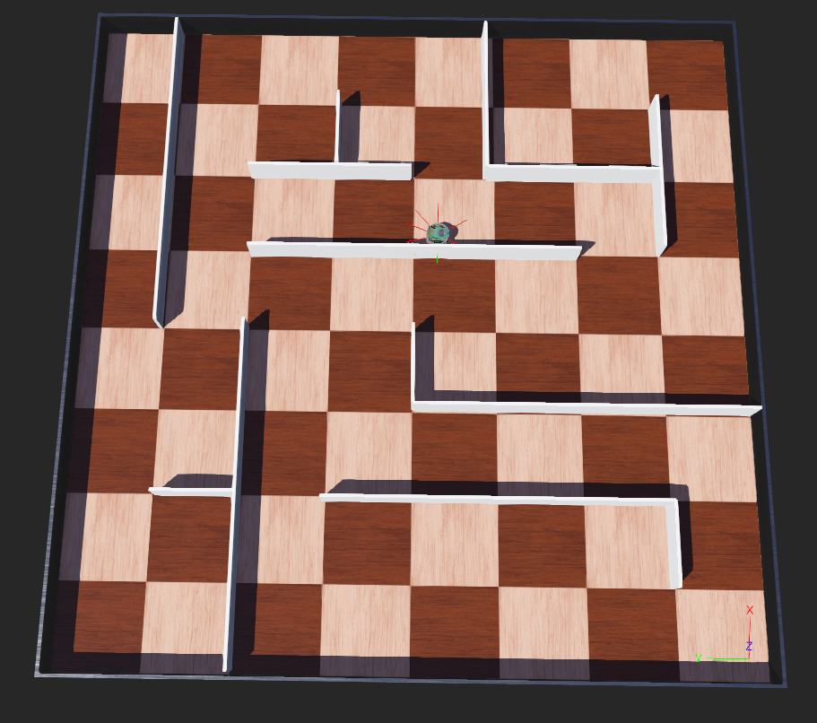

## กลุ่ม ชายสี่หมี่เกี้ยว
---
## แผนนที่

---
## ⚙️ อุปกรณ์ที่ใช้

- มอเตอร์ล้อซ้ายและขวา: `left wheel motor`, `right wheel motor`
- เซนเซอร์ระยะใกล้ (Proximity Sensors): `ps0` ถึง `ps7`

---

## 🤖 หลักการทำงานของหุ่นยนต์

หุ่นยนต์จะตรวจจับสิ่งรอบตัวด้วยเซนเซอร์:
- `ps5` ตรวจผนังด้านซ้าย
- `ps6` ตรวจมุมซ้าย (ระยะเฉียง)
- `ps7` ตรวจสิ่งกีดขวางด้านหน้า

### การตัดสินใจเคลื่อนที่:
- ถ้ามีสิ่งกีดขวางด้านหน้า → **หมุนขวาในที่**
- ถ้ามีผนังด้านซ้าย → **เดินตรง**
- ถ้าไม่มีผนังซ้าย → **เลี้ยวซ้ายช้าๆ**
- ถ้าเข้าใกล้มุมซ้ายเกินไป → **เบี่ยงขวาช้าๆ**

---

## 🧠 สรุปพฤติกรรมของหุ่นยนต์

| ตรวจพบผนังซ้าย | ตรวจพบผนังหน้า | พฤติกรรมหุ่นยนต์    |
|-----------------|-----------------|-----------------------|
| ✅               | ❌              | เดินตรง (Forward)     |
| ✅               | ✅              | เลี้ยวขวา (Turn right) |
| ❌               | ❌              | เลี้ยวซ้าย (Turn left) |

---
